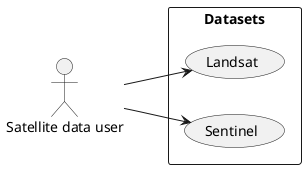

# Satellite Imagery Download

## Table of Contents
1. [Introduction](#introduction)
2. [About Sentinel 2](#about-sentinel-2)
3. [Sentinel Output File Architecture](#sentinel-output-file-architecture)
4. [Usage](#usage)
5. [Conclusion](#conclusion)

## Introduction

This document provides an overview of the Python code to download satellite imagery. It is based on the Google Earth Engine Python API. It primary use is for glacier study over the years.



## About Sentinel 2

For more information about Sentinel 2, refer to the following resources:
- [Wikipedia - Sentinel-2](https://en.wikipedia.org/wiki/Sentinel-2)
- [Copernicus Sentinel-2 Wiki](https://sentiwiki.copernicus.eu/web/sentinel-2)


## Sentinel Output File Architecture

The following schematic illustrates the architecture of Sentinel-2 files:

```
S2A_MSIL2A_20250321T102731_N0511_R108_T32TMS_20250321T142017.SAFE/
└── GRANULE/
    └── L2A_T32TMS_A026456_20250321T102731/
        └── IMG_DATA/
            ├── R10m/
            ├── R20m/
            └── R60m/
```

- **10 m**: Contains spectral bands 2, 3, 4, 8, a True Colour Image (TCI), and AOT and WVP maps resampled from 20 m.
- **20 m**: Contains spectral bands 1–7, bands 8A, 11, 12, a TCI, a Scene Classification (SCL) map, and AOT/WVP maps. Band 8 is omitted in favor of 8A for spectral precision.
- **60 m**: Contains all the spectral bands in the 20 m folder, plus band 9, TCI, SCL map, and AOT/WVP maps. Cirrus band 10 is omitted (no surface info).

## Usage

To use the Python code, follow these steps:

1. **Ensure you have Python installed on your system.**
2. **In your terminal, run one of the following depending on your environment:**
   - If using a virtual environment:
     ```sh
     pip install -r requirements.txt
     ```
   - If using a Conda environment:
     ```sh
     conda install --yes --file requirements.txt
     ```
3. **Open `Script/Sentinel_EE.ipynb` and follow the instructions.**

## Conclusion

This repository should help you search and download satellite imagery.

*Last updated: 2025-04-07 09:47:08 +0200*